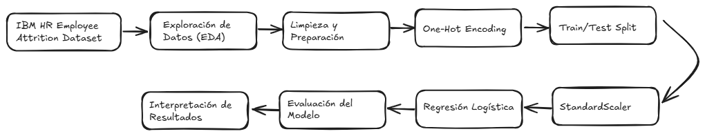

# Predicción de Rotación de Personal (Employee Attrition)

## Problema de Machine Learning

La rotación de trabajadores (Attrition) representa un desafío para las organizaciones debido a los costos asociados al reemplazo, capacitación y pérdida de conocimiento organizacional.

El objetivo de este proyecto es desarrollar un modelo de clasificación supervisada capaz de predecir si un trabajador abandonará la empresa utilizando información demográfica, laboral y de desempeño.

Variable objetivo:

* Attrition = 1 → El trabajador abandona la empresa.
* Attrition = 0 → El trabajador permanece en la empresa.

El problema corresponde a una tarea de clasificación binaria.

---

## Diagrama de Flujo del Proyecto

---

## Descripción del Dataset

Fuente:
IBM HR Analytics Employee Attrition & Performance

Cantidad de registros: 1.470 trabajadores

Cantidad de variables: 35

Variable objetivo:
Attrition

Distribución de la variable objetivo:

- No Attrition: 1233 trabajadores (83.9%)
- Attrition: 237 trabajadores (16.1%)

### Diccionario de Variables

#### Demográficas

* Age: Edad del trabajador.
* Gender: Género.
* MaritalStatus: Estado civil.
* Education: Nivel educacional.
* EducationField: Área de formación.

#### Laborales

* JobRole: Cargo.
* JobLevel: Nivel jerárquico.
* Department: Departamento.
* BusinessTravel: Frecuencia de viajes.
* OverTime: Realiza horas extra.
* YearsAtCompany: Antigüedad en la empresa.
* MonthlyIncome: Ingreso mensual.

#### Desempeño

* PerformanceRating: Evaluación de desempeño.
* TrainingTimesLastYear: Capacitaciones realizadas.
* PercentSalaryHike: Incremento salarial.

#### Variable Objetivo

* Attrition:

  * Yes = Abandona la empresa.
  * No = Permanece en la empresa.

---

## Model Card

### Modelo

Regresión Logística

### Objetivo

Identificar trabajadores con riesgo de abandonar la organización.

### Usuarios esperados

* Recursos Humanos
* People Analytics
* Gestión de Talento

### Variables utilizadas

Variables demográficas, laborales y de desempeño.

### Consideraciones

El modelo tiene fines de apoyo a la toma de decisiones y no debe utilizarse como criterio único para decisiones laborales individuales.

---

## Resultados

Conjunto de prueba: 486 trabajadores

### Métricas Offline

* Accuracy: 0.763
* Precision: 0.376
* Recall: 0.718
* F1-Score: 0.493
* ROC-AUC: 0.824

### Interpretación

El modelo logró una adecuada capacidad discriminatoria (ROC-AUC = 0.824), identificando correctamente el 71.8% de los trabajadores que efectivamente abandonaron la organización.

Se observa una precisión moderada debido al desbalance de clases presente en el dataset.

### Variables más influyentes

Factores asociados a mayor riesgo de abandono:

- JobLevel (OR = 2.56)
- JobRole_Sales Executive (OR = 2.34)
- JobRole_Laboratory Technician (OR = 2.31)
- OverTime_Yes (OR = 2.23)
- BusinessTravel_Travel_Frequently (OR = 1.92)

Factores asociados a menor riesgo de abandono:

- MonthlyIncome (OR = 0.53)
- EducationField_Life Sciences (OR = 0.56)

### Métricas Online

No se dispone de despliegue en producción, por lo que no existen métricas online al momento de esta versión.

---

## Conclusiones

1. El modelo logró identificar patrones asociados a la rotación laboral utilizando variables demográficas y laborales.

2. La capacidad discriminatoria obtenida (ROC-AUC = 0.824) indica un desempeño adecuado para diferenciar trabajadores con mayor o menor riesgo de abandono.

3. La realización de horas extra y los viajes frecuentes aparecen como factores asociados a un mayor riesgo de rotación.

4. Mayores niveles de ingreso mensual se relacionan con una menor probabilidad de abandono.

5. El modelo puede utilizarse como herramienta de apoyo para programas de retención de talento y gestión preventiva del riesgo de rotación.

Versión de desarrollo creada para fines académicos.
